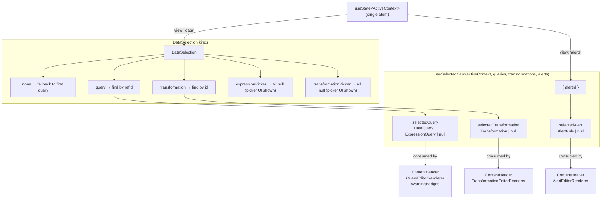
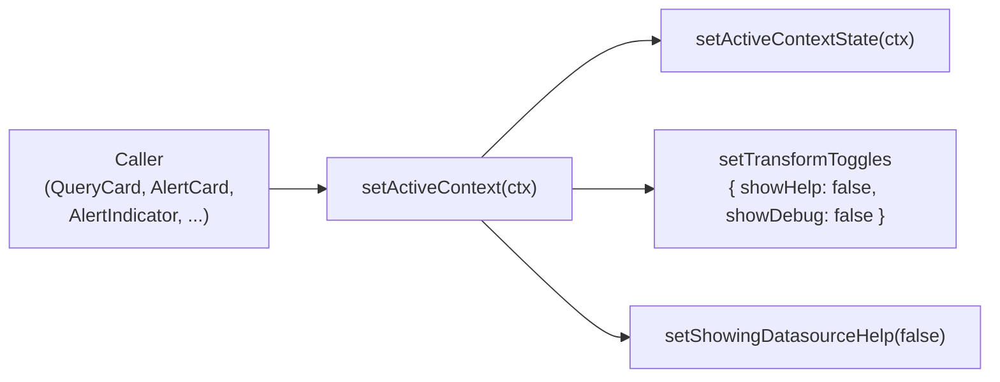
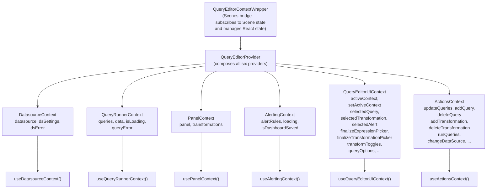
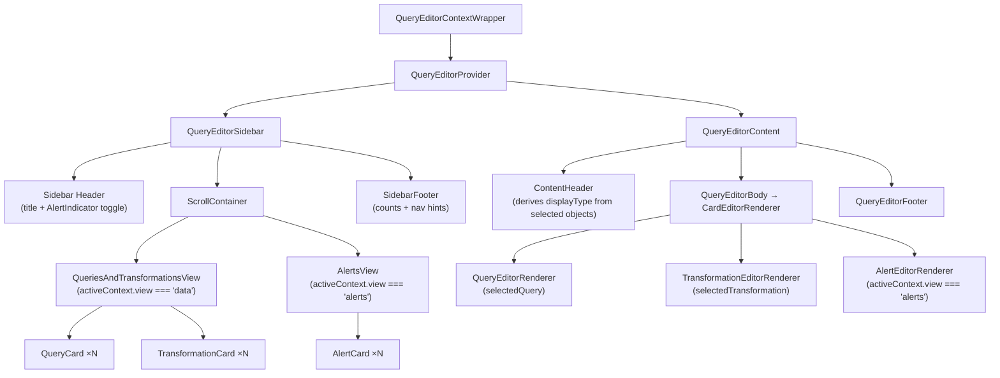

# Query Editor — Architecture

The Query Editor is the panel-edit experience for building queries, transformations, and alert rules. This document covers its state model, context architecture, component layout, and data flow.

---

## Layout

The editor is a two-pane layout: a **sidebar** (card list navigation) and a **content area** (header + editor body).

```
┌──────────────────────────────────────────────────────┐
│ QueryEditorContextWrapper (Scenes bridge)            │
│  └── QueryEditorProvider (6 React Contexts)          │
│       ┌────────────┬───────────────────────────────┐ │
│       │  Sidebar   │  QueryEditorContent           │ │
│       │            │  ┌─────────────────────────┐  │ │
│       │  Data view:│  │ ContentHeader           │  │ │
│       │  - Queries │  ├─────────────────────────┤  │ │
│       │  - Exprs   │  │ QueryEditorBody         │  │ │
│       │  - Transforms  │  CardEditorRenderer     │  │ │
│       │            │  ├─────────────────────────┤  │ │
│       │  Alert view│  │ QueryEditorFooter       │  │ │
│       │  - Alerts  │  └─────────────────────────┘  │ │
│       └────────────┴───────────────────────────────┘ │
└──────────────────────────────────────────────────────┘
```

---

## Core State Model — `ActiveContext`

`ActiveContext` is the **single source of truth** for what the user is currently doing. It is a TypeScript discriminated union stored in a single `useState` call inside `QueryEditorContextWrapper`.

```typescript
type DataSelection =
  | { kind: 'none' }
  | { kind: 'query';              refId: string }
  | { kind: 'transformation';     id: string }
  | { kind: 'expressionPicker';   insertAfter: string }
  | { kind: 'transformationPicker'; insertAfter?: string; showPicker?: boolean }

type ActiveContext =
  | { view: 'data';   selection: DataSelection }
  | { view: 'alerts'; alertId: string | null }
```

The union makes **impossible states impossible at the type level**:
- A query and a transformation cannot both be selected at the same time
- An alert cannot be selected while viewing data
- Pending pickers (`expressionPicker`, `transformationPicker`) are first-class states — no separate atoms needed
- Switching view and clearing the previous selection is a single atomic operation

The three derived objects — `selectedQuery`, `selectedTransformation`, `selectedAlert` — are resolved by `useSelectedCard` from `ActiveContext` + the raw data arrays. They are read-only and mutually exclusive.



---

## The Smart Setter

`setActiveContext` is the **only** state mutation entry point for navigation. Every context switch automatically resets stale UI state — callers never need to remember to do it themselves.



There is no `setSelectedQuery`, `setSelectedTransformation`, or `setPendingExpression` — everything goes through `setActiveContext`. Pending picker flows use the `expressionPicker` and `transformationPicker` `DataSelection` kinds directly.

### `finalizeExpressionPicker` / `finalizeTransformationPicker`

These two callbacks (on `QueryEditorUIContext`) handle the "commit" step of a picker flow:

1. Read `insertAfter` from the current `activeContext.selection`
2. Create the new query/transformation in the data layer
3. Transition `activeContext` to select the newly created item

They replace the old `usePendingExpression` / `usePendingTransformation` hooks entirely.

---

## Context Architecture

Rather than one large context blob, state is split across **six purpose-scoped contexts**. Components subscribe only to the context they need, minimising unnecessary re-renders.



---

## Component Tree



---

## Data Flow — Selecting a Card

The sequence below traces a user clicking a **QueryCard** in the sidebar through to the editor re-rendering.

```mermaid
sequenceDiagram
    actor User
    participant QCard as QueryCard
    participant SetAC as setActiveContext (smart)
    participant State as useState&lt;ActiveContext&gt;
    participant USC as useSelectedCard
    participant Header as ContentHeader
    participant Body as CardEditorRenderer

    User->>QCard: click
    QCard->>SetAC: setActiveContext({ view:'data', selection:{ kind:'query', refId:'A' } })
    SetAC->>State: setActiveContextState(ctx)
    SetAC->>State: setTransformToggles({ showHelp:false, showDebug:false })
    SetAC->>State: setShowingDatasourceHelp(false)

    State-->>USC: activeContext changed → re-run
    USC-->>Header: selectedQuery = queries.find('A')
    USC-->>Body: selectedQuery = queries.find('A')

    Header->>Header: derive displayType = Query
    Body->>Body: render QueryEditorRenderer
```

---

## `ContentHeader` — Prop-Based Design

`ContentHeader` is a **standalone, prop-based component** fully decoupled from React Context and Scenes. All data and callbacks are passed as props, making it reusable in non-Scene contexts (Alerting, Explore).

`ContentHeaderSceneWrapper` is the thin Scene-aware adapter that reads from context and passes props down:

```
ContentHeaderSceneWrapper
  ├── reads: activeContext, selectedQuery/Transformation/Alert, setActiveContext
  ├── derives: isExpressionPicker, isTransformationPicker from activeContext.selection.kind
  └── renders: <ContentHeader pendingExpression={isExpressionPicker} ... />
```

`ContentHeader` itself never touches context — it accepts `pendingExpression?: boolean` and `pendingTransformation?: boolean` as explicit props.

---

## Key Invariants

| Invariant | Enforced by |
|---|---|
| Query and transformation cannot both be selected | `DataSelection` discriminated union — only one `kind` can be active |
| Alert cannot be selected while in data view | Separate `view: 'alerts'` branch on `ActiveContext` |
| Pending pickers are always cleared on navigation | `setActiveContext` transitions the whole state atomically |
| `selectedQuery`, `selectedTransformation`, `selectedAlert` are mutually exclusive | `useSelectedCard` gates each on the `activeContext` discriminant |
| `ContentHeader` is self-contained | Fully prop-based; `ContentHeaderSceneWrapper` handles the Scene bridging |
| `cardType` is never stored in context | Computed locally via `getEditorType()` where needed (HeaderActions, QueryActionsMenu) |
